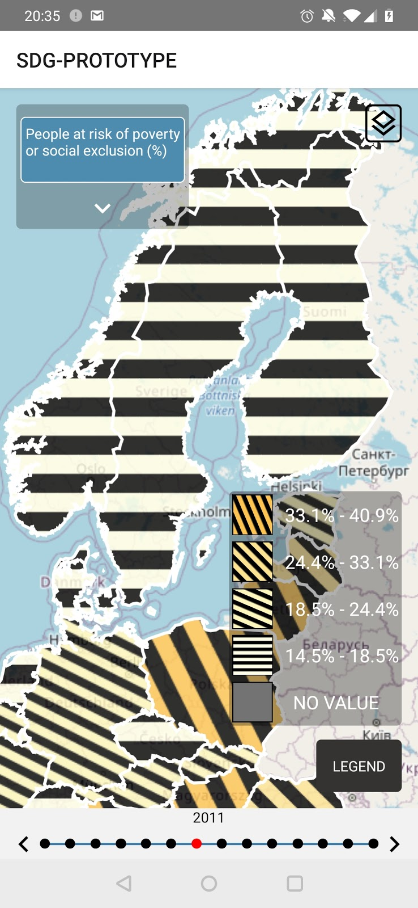
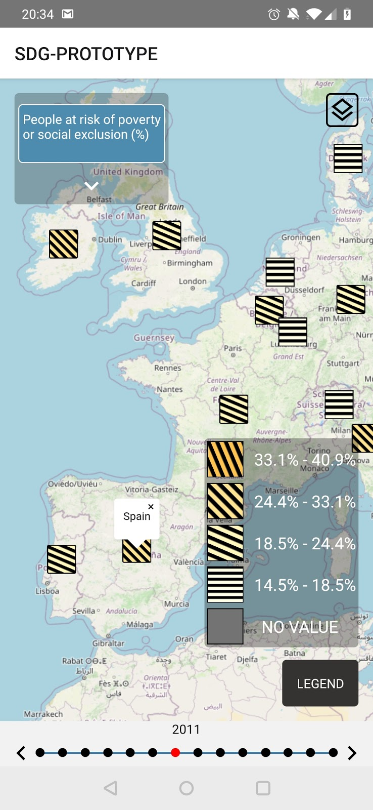

# SDG Visualization Prototype

A mobile application _(currently android only)_ for visualizing SDG data with `choriented maps` among other visualization types.

## Getting Started

Download / Clone this repository.

The repository contains SDG data and a geojson file with countries. The files can be replaced / extended with data or files.

You can find the data files in the `pecularities` folder.


### Prerequisites

This application is developed with [React-Native](https://reactnative.dev/). Follow the installation guide from the official docs. 

Make sure to use the `React Native CLI Quickstart` guide and not the `Expo` guide.

### Installing

- Install dependencies in root using npm:

  ```
  npm install
  ```

- Run the react-native application

    ```
    react-native run-android
    ```


You should see an output similar to this: 

```javascript
    BUILD SUCCESSFUL in 9s
    209 actionable tasks: 2 executed, 207 up-to-date
    info Connecting to the development server...
    8081
    info Starting the app on "699dbac6"...
    Starting: Intent { cmp=com.gorte.sdgviz/.MainActivity }
```

When activating the debuggin mode, you can find the debugger-ui here: 

`http://localhost:8081/debugger-ui/
`

## Data Format
The country data and the SDG data need to be provided in the following format.

### Country Geojson
The geojson file with the country shapes follows the [geojson standart](https://tools.ietf.org/html/rfc7946) by the IETF.
Each country needs an `ADMIN`property, which holds the name of the country. That name should be identical to the country name in the SDG data file.

Example:

```geojson
{
   "type":"FeatureCollection",
   "features":[
      {
         "type":"Feature",
         "properties":{
            "ADMIN":"Germany"
         },
         "geometry":{
            "type":"MultiPolygon",
            "coordinates":[
               "..."
            ]
         }
      },
      {
         "type":"Feature",
         "properties":{
            "ADMIN":"France"
         },
         "geometry":{
            "type":"MultiPolygon",
            "coordinates":[
               "..."
            ]
         }
      }
   ]
}

``` 


### SDG Data
* Each goal contains all the countries that have data for that goal.
* Each country contains a timeseries for that country.
* The timeseries of each country of a goal **must** contain the same set of years.

Example:

```json
{
  "goal_1" : {
    "country_1": {
      "2017": 13.0,
      "2018": 14.1,
      "2019": 15.4
    },
    "country_2": {
      "2017": 10.0,
      "2018": 10.1,
      "2019": 10.4
    },
    "country_3": {
      "2017": 9.0,
      "2018": 9.1,
      "2019": 9.4
    }
  },
   "goal_2" : {
    "country_1": {
      "2016": 13.0,
      "2017": 13.0,
      "2018": 13.1,
      "2019": 13.4
    },
    "country_2": {
      "2016": 11.0,
      "2017": 11.0,
      "2018": 11.1,
      "2019": 11.4
    },
    "country_3": {
      "2016": 10.0,
      "2017": 10.0,
      "2018": 12.1,
      "2019": 10.4
    }
  }
}
```

## Choriented Maps
This prototype uses choriented maps, among other visualization types, for visualizing SDG data.

Choriented maps are an extension of choropleth maps, both are based on color values as their
[Visual Variable](https://www.researchgate.net/publication/317266613_Visual_Variables). Since color values are highly impacted by lighting conditions, 
that come with the mobility aspect of mobile devices, we extend the color value visual variable with orientation lines. 
Orientation lines allow for easier comparison between geographic entities.

There are two types of choriented maps:


| ChorientedMap     | Choriented Mobile Map     |
|------------|-------------|
|------------|-------------|
| Covers whole shape     | Marker filled with pattern     |
|------------|-------------|
| ||


## Built With

* [React-Native](https://reactnative.dev/)
* [Mapbox GL JS](https://docs.mapbox.com/mapbox-gl-js/api/)
* [Center Of Polygon](https://github.com/mapbox/polylabel)
* [TinyQueue](https://github.com/mourner/tinyqueue)

## Author

* **Viktor Gorte** 
